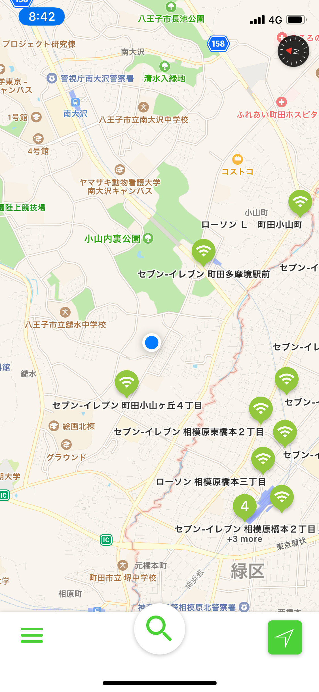

# FiMap-iOS
> TKGeem's iOS map application. search some facility informations.

## Installation & Setup

In terminal:

```bash
cd FiMap/
pod install
FiMap.xcworkspace/
```
and bulid in Xcode.

## Usage example

Search the surrounding facilities information from the map and find the name by word search.

## Screen shot
 

## Current specification
* WiFi spot only support
* Search from word
* Display facility information

## Future
* Corresponds to many facility information
* Flexible search method
* Directions

## Release History

* 1.0 v1
  * Test semi-public

## License

[](http://badges.mit-license.org)

- **[MIT license](http://opensource.org/licenses/mit-license.php)**
- Copyright 2018 © <a href="https://github.com/TKGeem" target="_blank">TKGeem</a>.
